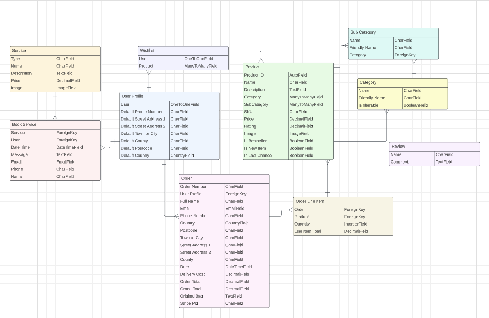

# HappyRoom 

#### _Please note that this website is for educational purposes and should not be treated like a real website._

HappyRoom is a B2C e-commerce store targeting individuals looking to enhance their living or working spaces with unique wallpapers and interior design services.

At HappyRoom, the users can explore a variety of carefully selected wallpapers, each with its own distinct design to suit different tastes.
The user are also offered personalized assistance through consultations with our team of experts.
Additionally, the user can stay informed about new arrivals and special offers by subscribing to our newsletter, and also share their thoughts with us through our customer reviews.

HappyRoom aims to provide users with the tools and resources needed to transform their spaces into personalized expressions of style and creativity. 

HappyRoom uses Stripe as a payment method.
Please note:
_You should not enter any personal credit or debit card information, since this store is only for educational purposes._

For a live demonstration, visit [HappyRoom](https://happy-room-e68715746875.herokuapp.com/)

## Table of Contents

## UX

### User Stories
##### Profile
- As a site user I can sign up to the site so that my own personal account is created.
- As a site user I can log in and log out of the page.
- As a logged i user I can choose if I want to save my information so that it will speed up the checkout process next time.
- As a site user I can buy products of the store while im logged in so that it's an easier process for me viewing my prefilled personal details.
- As a site user I can view my previously made orders so that I can easily find what I bought last time
- As a logged in user I can easily see that I am activily logged in so that if I am not, I can log in

##### Products

- As a site user I can easily navigate through the website so that I can find what I am looking for
- As a site user I can easily brows through the different products so that I can find what I am looking for.
- As a site user I can sort and filter the products so that I only view the product I am interested in.
- As a site user I can save or like products so that I can easily find them again.
- As a site user I can find inspirational images of the products so that i can imagine what the room will look like
- As a site user I can view my shopping bag and the total price so that I know how much money I shop for.
- As a site user I can be assured that the payment is secure.

##### Other requirements
- As a site user I can sign up for newsletter
- As a site user I can book a meeting with an expert so that I can get help with advising and design.
- As a site user I am informed about how my personal information is going to be handled, and what the stores privacy policy is.
- As a site user I can fast and easily find information about the company so that I can get answers if I have any questions

##### Site Administration
- As a site owner I can create, edit and delete products
- As a site owner I can send out newsletter so that the user who signed up for it can recieve them
- As a site owner I can inform the user about the company so that the user knows what the purpose of the company and site is

#### Future User Stories to Consider
- As a site user I can post images with my customer review
- As a site user I can find a gallery with pictures showing how expert advice helped previous customers.

## Design & Layout 
The site features a clean design with earthy elements, blending brown and pink hues with white for a serene and luxurious atmosphere.

### Color Scheme 

The color scheme of HappyRoom is soothing, mainly in earthy tones with a hint of pink. These colors harmonize well with the website's purpose, offering users a relaxed and welcoming environment.

### Images
All media is uploaded with Amazon Web Services and all images is borrowed from the real wallpaper site 
[Belarte Studio.](https://belartestudio.com/)

_Please note that this website is for educational purposes only and should not be regarded as a real e-commerce platform. For genuine products, visit [Belarte Studio.](https://belartestudio.com/)_

### Fonts

The Montserrat font is used on the main content of the website, for example, all product description and FAQ page. 
The Playfair Display font is used on all headings, as well as the logo name in the header.

All fonts are from [Google Fonts](https://fonts.google.com/).

### Favicon 

The favicon was generated through [Favicon.io](https://favicon.io/) and depicts the logo for HappyRoom.

### Icons

All icons and symbols are from [Font Awesome.](https://fontawesome.com/)

### Wireframes

Wireframes were produced using Balsamiq.

## Agile Methodology

For project management, I used GitHub Projects for an agile approach. You can access the project board [here.](https://github.com/users/tildeholmqvist/projects/10)

During the planning phase, I created twenty GitHub Issues, with two additional as future improvement.
Each issue is followed by a set of acceptance criteria, making the execution of the task clear, and easier to navigate to completion.

## Data Model

When building this B2C e-commerce site, the principles of object-oriented programming (OOP) was used, which organize data into easily manageable chunks. This makes it simpler to handle different aspects of our platform, like categories, products, and user profiles.

### Security Features
#### User Authentication
To ensure safe and easy user access, Django Allauth is implemented for user authentication, allowing users to securely log in and manage their accounts.

#### Form Validation
If the submitted form is not valid, an error will accour telling the user what field is missing or is incorrect.
If any submitted form is not valid or contains errors, users will receive a clear error message, showing which fields is causing the error.

#### Custom 404 error page
If a user come across a wrong URL, they will be directed to a custom 404 error page, allowing the user to easily go back to the homepage.

#### Database Security
Sensitive information, such as database URLs, secret keys, stripe keys, webhook secrets, AWS credentials, and email access, are stored securely in the env.py file to prevent unauthorized access.

## Features

### Header

#### Logo
- A logo was created using the Playfair Display font.
- The logo is positioned in the top left of the site, and is linked to the home page for an easier navigation for the site user.

#### Navigation Bar

- The header and navigation bar are present on every page and include every link to the other pages.
- The navigation menu includes three different dropdown menus allowing the user to browse products sorted by '"Room, "Color", "Pattern" and "Latest Deals".
- The navigation menu also includes a link to the Services page, where the user can book an appointment with one of our experts, and a link to the FAQ page.
- The navigation bar is fully responsive, transforming to a hamburger symbol on smaller screens and devices.

#### Search Bar

- The search bar is displayed above the navigation links.
- On smaller screens and devices, the search bar becomes a search icon. Clicking it will show the full search bar.
- When entering a word in the search bar, all products containing that word in their title or description, will be presented in the search results.

#### User Icon 

- When users are not signed in, the user icon displays a dropdown menu offering the options "Register" and "Log in".
- Once users are signed in, the user icon shows a dropdown menu with the choices "My Profile" and "Log Out".
- Additionally, for signed-in site administrators, the user icon provides the option "Product Management", giving access to add products or services.

#### Bag Icon

- Positioned to the right of the user icon, users will find the bag icon.
- The bag manages the items in the user's bag, with the total cost visible underneath.
- Whenever users add, delete, or edit items in their bag, a toast message notifies them of the success or failure of their action.
- Clicking on the bag icon allows users to view the contents of their bag, along with prices and the remaining amount required for free delivery.
- When clicking the bag icon, users have the option to proceed to a page where they can view their bag and proceed to the checkout process.

### Footer

- The footer is present at the bottom of every page across the site.
- The footer features links to the site's social media profiles on Facebook, LinkedIn, Instagram, and Pinterest.
- Additionally, the footer includes a signup section for the MailChimp Newsletter, enabling users to subscribe and receive updates on the latest deals and offers.
- Other footer links include access to the products page, services page, FAQ page, Custom Reviews, and the Privacy Policy.
- All external links automatically opens in a new tab.

### Home Page

- The homepage features a carousel showcasing three images from our latest collection.
- A section on the homepage informs users about the website's purpose.
- Towards the bottom of the homepage, two images provide easy access to products categorized under "By Room" and "By Pattern".

### Profile Page
##### Delivery Information
- The delivery details section saves the user's delivery address and phone number.
- This information is used to fill in the users delivery address automatically when they are accessing the check out.

##### Order History

- The order history section shows a list of all orders placed by the user.
- Each order includes the order number, date of purchase, item details, and total cost.
- When clicking on the order number, it redirects the user to a page summarizing the order details.

##### Booked Services

- Below the Order History, users can find a section listing all booked appointments.
- Each booking displays a booking ID, appointment date, booked service, and forthcoming cost.
- When clicking on the booking ID, it redirects the user to a page summarizing the booking details.

#### Wishlist

- Located below the Booked Services, users can find a section listing all products they've added to their wishlist.
- Each wishlist item displays the product title and image.
- When clicking on the product in the wishlist, it redirects the user to the product detail page.

### User Account Pages

- Django allauth was installed and used to implement the Sign up, Log in, and Log out functionality. 
- Success messages notify users of successful login/logout actions.
- When the user is register for an account, the user must verify their email address by clicking on the authentication link sent to the provided email address.
- Users can reset their password by clicking on the 'Forgot Password' link on the login page if they forget it.

### The Categories Pages

- Under the "Latest Deal" menu, users can choose from different categories such as "New In," "Bestsellers," "Last Chance," and "View all," each redirecting them to the product page.
- In the other dropdown menus within the navigation bar, users can select categories. If they want to see all products in a specific category, they will be lead to a page where they can further filter by subcategories.
- The visibility of products depends on the category selected by the user.
- Every product is displayed with an image, title, rating and price.

### The Products page

- When clicking on a product, the user will get transfered to a page featuring a more detailed information about the product.
- Alongside the title, rating, and price, users will find a detailed product description.
- Each product description provides helpful information about measurements, helping users choose the right amount.
- If the user is unsure about sizing and quantity, a link is provided for users to schedule a meeting with an expert for personalized advice.
- The user can adjust the quantity and add the product to their shopping bag.
- If the user is logged in they can also add products to their wishlist, that is accessible in their profile that can be found under the user icon.
- If the user is a site administrator an edit and delete button will also appear in the product details.

### Services Page

- Every service is displayed with an image, title, description and price.
- Clicking on a service redirects the user to a page providing detailed information about the service.
- Below the service description, users find a booking form to schedule appointments.
- After booking an appointment, users receive a success message confirming that the booking was successful.
- After booking the appointment, the user are directed to a page summarizing the appointment details.
- Payment for appointments is not required in advance, allowing users to schedule meetings without upfront payment.

### Product and Service Management

#### Add Product

- Only site administrators and superusers can create and add products.
- Access the "Product Management" option from the dropdown menu under the user icon to reach the add product page.
- The service form must be valid to add a service, and every required field is marked with an asterisk (*).
- Product prices must be greater than 0 and cannot exceed 6 digits in total.
- The user have the option to upload an image for the product. If no image is provided, a default image is displayed.
- Once the form is filled out and validated, the product can be created by clicking the add button.
- The user will receive a success message confirming that the product has been successfully added.

#### Edit Product

- Only site administrators and superusers can edit products.
- The user can access the edit page by clicking the "Edit" button located either under the product or within the product details.
- When opening the edit form, all fields are pre-populated with their original content.
- The image field presents a preview of the existing image, along with a checkbox option to remove it. Selecting this checkbox will replace the image with the default one.
- The user will receive a success message confirming that the product has been successfully edited.

#### Delete Product

- Only site administrators and superusers can delete products.
- The user can delete the product by clicking the "Delete" button located either under the product or within the produt details.
- Upon clicking "Delete," a confirmation modal will appear, asking the user to confirm the deletion.
- The user will receive a success message confirming that the product has been successfully deleted.

#### Add Service

- Only site administrators and superusers can create and add services.
- Access the "Product Management" option from the dropdown menu under the user icon to reach the add service page.
- The service form must be valid to add a service, and every required field is marked with an asterisk (*).
- Service prices must be greater than 0 and cannot exceed 6 digits in total.
- The user have the option to upload an image for the service. If no image is provided, a default image is displayed.
- Once the form is filled out and validated, the service can be created by clicking the add button.
- The user will receive a success message confirming that the service has been successfully added.

#### Edit Service

- Only site administrators and superusers can edit services.
- The user can access the edit page by clicking the "Edit" button located either under the service or within the service details.
- When opening the edit form, all fields are pre-populated with their original content.
- The image field presents a preview of the existing image, along with a checkbox option to remove it. Selecting this checkbox will replace the image with the default one.
- The user will receive a success message confirming that the service has been successfully edited.

#### Delete Service

- Only site administrators and superusers can delete services.
- The user can delete the service by clicking the "Delete" button located either under the service or within the service details.
- Upon clicking "Delete," a confirmation modal will appear, asking the user to confirm the deletion.
- The user will receive a success message confirming that the service has been successfully deleted.

### Bag

- Clicking on the bag icon in the navigation menu redirects the user to the shopping bag page, where they can view the contents of their cart.
- The bag displays product information including the image, description, price, and quantity.
- The user can adjust the quantity by clicking the plus or minus buttons.
- Products with a quantity less than 0 are automatically removed from the bag.
- To update the quantity, users can click the "Update" button.
- To remove a product, users can use the "Remove" button.
- Below the product information, users can view the total cost of the bag, delivery cost, and grand total.
- If there is any remaining spending required for free delivery, that is also provided. 
- The user can then choose to continue shopping or proceed to secure checkout by clicking the respective buttons.

### Checkout 

#### Details Section

- In the details section, users can input their contact information, delivery address, and card details.
- If the user is not logged in or doesn't have an account, a link to login or create an account will be provided.
- The user also have the option to make a purchase as a guest.
- For signed-in users who haven't saved their information, there's a checkbox to save the delivery information.
- Logged-in users who have opted to save their information will find their details pre-filled.
- If any required fields are left blank, an error message will appear, asking the user to fill them in.
- All required fields are marked with an asterisk (*).

#### Order Summary 

- The order summary section provides an overview of the products to be purchased, including their details.
- It showcases the product name and image, quantity, subtotal, delivery cost, and grand total.products and the subtotal, delivery and grandtotal. 
- Clicking on the product image within the order summary redirects the user to the respective product detail page.

#### Payment 

- The payment system is powered by Stripe to ensure secure transactions.
- Invalid card numbers will trigger an error message for the user to correct the issue.
- During payment processing, a loading screen is displayed, preventing the user from navigating away.
- A warning message is displayed at the bottom of the page, informing the user of the expected charge amount.
- Even if the payment form fails to submit or the user closes the browser during processing, orders are still created in the database through a webhook
- After the payment is processed, the webhook verifies order existence in the database. If not found, it creates one using payment details.

#### Confirmation

- After the order is processed, the user is directed to the checkout success page.
- On the checkout success page, the completed order is summarized.
- Additionally, an email containing the order confirmation will be sent to the user.
- Finally, at the end of the summary, a "Keep Shopping" button allows the user to return to the product page.

### Frequently Asked Questions (FAQ)

- The FAQ page provides answers to common questions that our customers frequently ask.
- The user can easily navigate through various questions to find the information they need.
- At the bottom of the FAQ page, the user can find contact information in case they have additional questions or inquiries.

### Customer Reviews

- The user can access our customer reviews page located in the footer of our website.
- On this page the user can explore feedback and testimonials from previous customers to gain insights into their experiences.
- The user can share their own thoughts and feedback by filling out a simple form with their name and comments.

## Business Model 

HappyRoom operates under a B2C (Business to Consumer) model, selling products and services directly to end-users, who are our customers.

Our typical customers are homeowners, mainly adults or families seeking to redecorate their living spaces.

## Marketing Strategy

HappyRoom uses different marketing strategies to connect with its audience, including SEO, content marketing, social media marketing, and email marketing.

### SEO

We carefully choose keywords, both short and long, after studying Google search results and our competitors' strategies. These keywords are added to our website's meta keywords and descriptions to improve our search engine ranking.

| Keyword | Related Keywords |
|---------|------------------|
| Wallpaper | Modern Wallpaper, Aesthetic Wallpaper, Cute Wallpaper, Peel & Stick Wallpaper, Luxury Wallpaper, Custom Wallpaper, Design Wallpaper |
| Room | Kitchen, Livingroom, Bedroom, Kidsroom, Room designer, Romantic Bedroom Wallpaper, Room decor ideas |
| Interior | Interior room, Interor design, Interior Diy, Inspiration interior, Wallpaper design 3d, Wallpaper shops, Wallpaper Store |

#### Building Trust

We include a customer reviews page where users can read reviews and comments from previous customers. Additionally, links to both the customer reviews and privacy policy are included in the footer to inform users about how their data is being collected and processed.

#### Sitemap and robots.txt

To make search engine navigation easier, a sitemap was created, listing important page URLs using xml-sitemaps.com. Additionally, a robots.txt file is created to specify areas of the website that search engines should avoid, enhancing overall site quality for SEO purposes.

### Content Marketing

We showcase high-quality images of our interior design projects to attract potential clients and build trust. These photos highlight our expertise and unique styled wallpapers.

#### Social Media Marketing

Social media marketing is used through platforms like Facebook, Instagram, and Pinterest because many people seek inspiration there. This complements  the content marketing, as we can easily share images of past projects and new products. We also run sales and offer discounts through ads on these platforms to catch our customers attention.

# FACEBOOK BILD/LÄNK

#### Email Marketing

Additionally, our users can sign up for our newsletter to receive news, updates, and deals. We use Mailchimp to manage this service, making it easy for us to stay connected with our customers.

Overall, by using a mix of these strategies, HappyRoom aims to reach more people, bring more traffic to the website, and increase both sales and brand awareness.

Understanding our users' needs is our top priority. 
They want clear information, guidance, and inspiration, so we provide useful content like inspiring pictures and helpful guides. Our business goals shape our marketing strategies, to meet these goals effectively.
